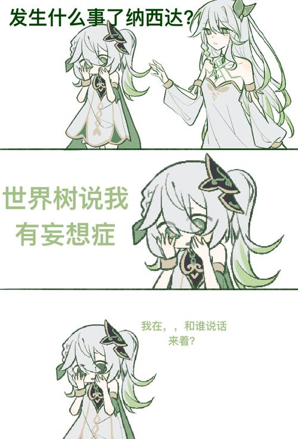

# 谁人的碎片

> 想亲手造一方只属于自己的世界。
>
> *至少，这个世界的一砖一瓦，都是咱亲手砌上的。*
>
> *Code is law. The world is in my law.*

---
  
**INFP** · 想要一个梦  
> unforylty.you lost

Blurred I/O Stream · typo  
图形学 · 并行计算 · GPGPU  
C / C++ · Clang · LLVM · STD  
Vulkan · OpenGL · OpenCL · HLSL

**Nanokoli**
